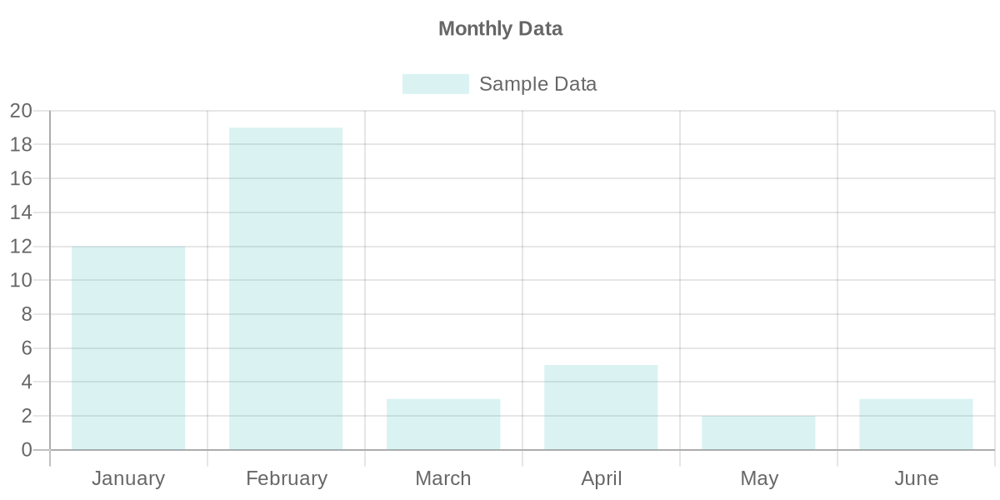
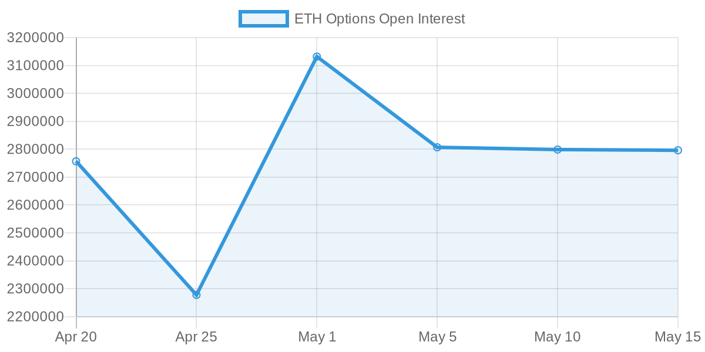

# QuickChart MCP Server

An Python MCP server implementation for [QuickChart.io](https://quickchart.io/), allowing you to generate and download charts directly through Claude Desktop and other MCP clients.



## Installation

```bash
# Clone the repository
git clone https://github.com/yourusername/quickchart-mcp.git
cd quickchart-mcp
```
## Usage

### Running as a standalone MCP server

```bash
uv run src/server.py
```

### Configuring in Claude Desktop and other MCP clients

Add the following configuration to your Claude Desktop configuration file or equivalent for other MCP clients:

```json
"quickchart": {
  "command": "/path/to/uv",
  "args": [
    "run",
    "--directory",
    "/path/to/quickchart-mcp/src",
    "server.py"
  ]
}
```

Make sure to replace `/path/to/uv` with the actual path to your uv executable and `/path/to/quickchart-mcp/src` with the path to your quickchart-mcp source directory.

## Available Tool

### `generate_chart`

Generates a chart using QuickChart and optionally downloads it.

**Features:**

- Generate a wide variety of chart types: bar, line, pie, doughnut, radar, polarArea, scatter, bubble, radialGauge, and speedometer
- Easily customize your charts with data labels, multiple datasets, custom colors, and extensive configuration options
- Retrieve a URL to view your chart online or download it directly as an image file
- Uses Pydantic models for robust input validation and type checking

**Basic Parameters:**

- `chart_input`: Chart configuration object
- `download`: Whether to download the chart (default: False)
- `output_path`: Path to save the chart image (optional)

**Example:**

QuickChart uses Chart.js configurations as input to render images:

```json
  {
    "type": "line",
    "datasets": [
      {
        "label": "ETH Options Open Interest",
        "data": [2756584.1, 2277777.2, 3131823.3, 2806715.4, 2798619.4, 2795944.7],
        "fill": true,
        "borderColor": "#3498db",
        "backgroundColor": "rgba(52, 152, 219, 0.1)"
      }
    ],
    "labels": ["Apr 20", "Apr 25", "May 1", "May 5", "May 10", "May 15"],
    "options": {
      "plugins": {
        "title": {
          "display": true,
          "text": "ETH Options Open Interest"
        }
      },
      "scales": {
        "y": {
          "beginAtZero": false,
          "title": {
            "display": true,
            "text": "Open Interest (ETH)"
          }
        }
      }
    }
  }
```

The tool returns a QuickChart URL (e.g., https://quickchart.io/chart?c=...) that can be accessed directly in a browser, displayed inline in applications, or embedded in web pages. When download is enabled, it returns the local path to the saved image file instead. Output of above config shown in .

See the [QuickChart documentation](https://quickchart.io/documentation/) for more configuration options.

## Requirements

- Python 3.12+
- Dependencies: httpx, mcp, python-dotenv, pydantic, quickchart-io
